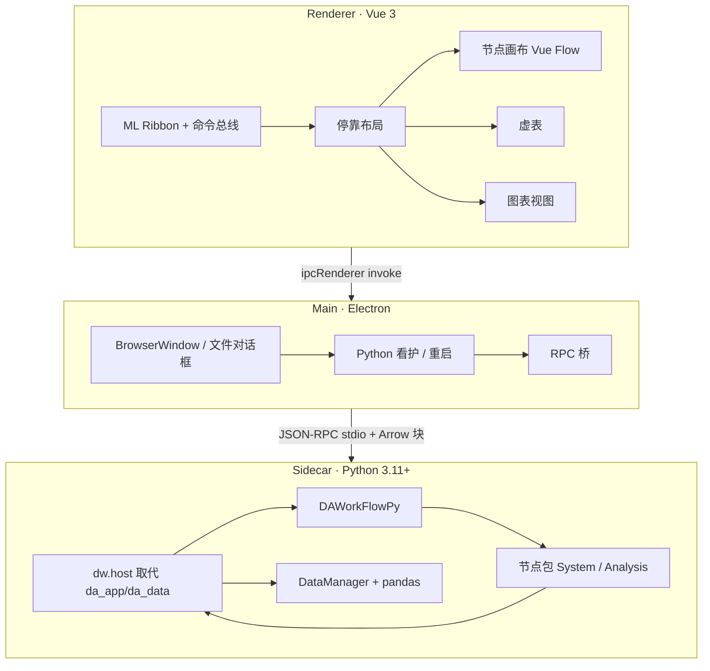
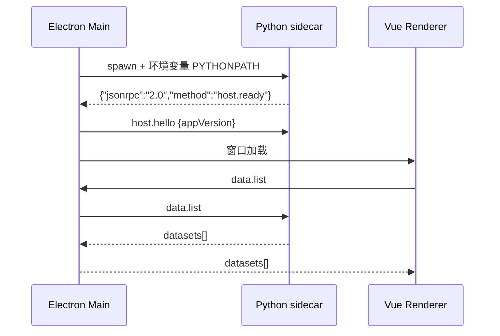
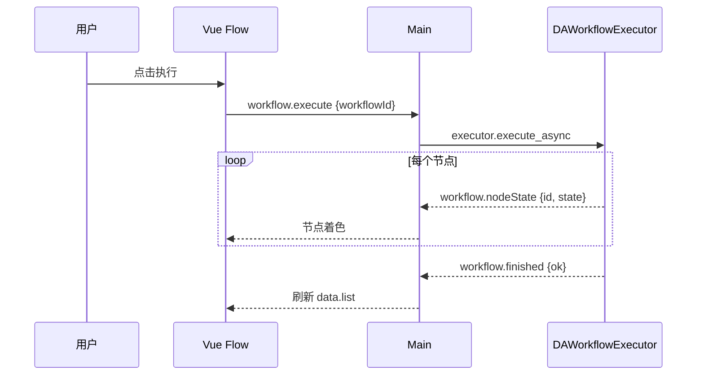

# 架构

DataWorkbench 采用**三进程**结构：渲染进程只持有视图状态，主进程只做窗口与子进程看护，Python sidecar 持有全部业务模型。这对应上游已经验证的「Python 模型 / C++ 视图」分离，只是把 C++ 视图换成 Vue。

## 主要分层

依赖方向：**渲染进程不直接 spawn Python**；**Python 不 import Electron**；**主进程不跑 pandas**。

## 和上游模块的映射

| 上游 | 本仓库 | 策略 |
|------|--------|------|
| APP + DAGui 壳（Ribbon/Dock） | `apps` Vue 壳（`@dw/app`） | 重写 |
| SARibbon | `@mlightcad/ribbon` | 替换 |
| Qt-Advanced-Docking-System | 一期固定分区，二期 Golden Layout | 降级后重写 |
| DAPyWorkFlow C++ 代理 | 删除 | Python 引擎直连 RPC |
| `DAWorkFlowPy` | `python/dw_workflow`（vendor + 改名空间） | 复用 |
| DAData + 虚表 `fetchBlock` | `dw.host.data` + 前端虚表 | 协议复用，实现重写 |
| DAFigure / Qwt / ChartSetting | `packages/chart` | 一期重写缩小范围 |
| DAGraphicsView | Vue Flow | 重写 |
| DAPyBindQt | 删除 | 进程内 GIL 问题变成 IPC |
| DAAgent / 插件工具 | 不实现 | — |
| DAPluginSupport C++ | Python 节点扫描 + 前端 command 注册 | 改契约 |
| DAAxOfficeWrapper | 不做一期 | — |

## 运行时数据所有权

| 对象 | 所有权 | 前端持有的副本 |
|------|--------|----------------|
| DataFrame / Series | Python DataManager | 当前窗口的 `fetchBlock` 行、schema |
| 工作流节点实例、参数、连接 | `DAWorkflow` | `node_id`、qualified_name、端口、布局坐标 |
| 图表数据绑定（列名、降采样点） | Python 生成视图序列 | 供画布使用的 typed array |
| Ribbon 激活 tab、停靠比例 | 前端 | 写入工程 `ui-layout.json` |
| 工程脏标记 | 主进程协调 | 任意一侧 mutation 上报 |

## 关键时序

### 启动

未收到 `host.ready`（默认 20s）则主进程报错，不打开空白壳假装可用。

### 工作流执行（对齐上游：Python 执行，UI 只收状态）

执行在 sidecar 后台线程进行（上游 `execute_async` 已支持）。UI 进度只来自 RPC 通知，禁止在渲染进程「模拟执行」。

### 工程加载铁律

与上游相同：**Python 逻辑先于视图**。

1. 解压 ZIP 到临时/缓存目录（主进程）。
2. `workflow.loadLogic(xml|json)` → sidecar `from_xml` / `from_dict` 建好节点。
3. 前端按 `node_id` **wrap** 图形节点，禁止再 `createNode`（否则 Python 侧重复建点）。
4. 再加载 `ui-layout.json`、图表绑定。

## 线程与 GUI

Python 节点若要改 DataManager，在 sidecar 内用**同一把锁**（DataManager 线程安全队列），由 RPC 事件循环线程执行变更，再 notify。不要在节点线程直接碰将来可能出现的 UI 回调。上游 `callInMainThread` 在本架构中的对应物是：**所有 Host 变更投递到 sidecar 的 RPC 线程**。

## 错误模型

- RPC 业务失败：JSON-RPC `error` `{code, message, data}`，`message` 英文给日志，另附 `i18nKey` 给 UI。
- sidecar 崩溃：主进程捕获 `exit` → 通知渲染层 `host.crashed` → 意外退出最多自动重启一次（故意 `shutdown` 不重启；第二次崩溃只提示）。重启后内存 DataFrame 丢失：渲染层立刻清空画布并 `project.reset(null)`，禁止用空工程覆盖已保存的 `.dwproj`；用户需 File → Open。
- 渲染进程崩溃：Electron 默认行为；不自动静默丢 Python 进程（主进程仍在则 sidecar 可留）。
