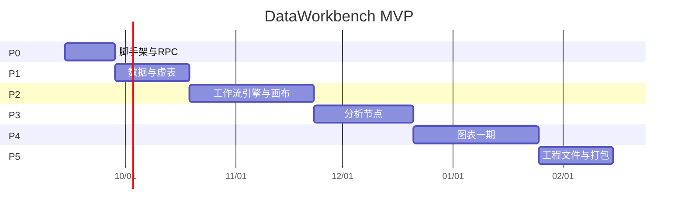

# 路线图与里程碑

人力假设：1 名全职工程师（Vue 3 + Python 熟练）。两人时 P1 与 P2 可部分重叠。单位为**日历周**，含联调，不含学习 Electron 的额外缓冲。

**交付节奏**：每完成路线图里的一项可验收任务（不是整阶段攒完）就自测、commit 并 push 到 [Kinvy66/DataWorkbench](https://github.com/Kinvy66/DataWorkbench.git)。阶段退出标准全部满足时再补一次阶段提交。细则见 [AGENTS.md T11](../../AGENTS.md) 与 [12-quality.md](./12-quality.md)。

## 阶段总表

| 阶段 | 周期 | 目标 | 退出标准（摘要） |
|------|------|------|------------------|
| P0 骨架 | 2 周 | 窗口 + Ribbon 空壳 + sidecar ping | `host.hello` 往返；日志面板能看到 stderr |
| P1 数据 | 3 周 | 导入与虚表 | 50 万行 csv 可滚动；关闭窗口内存不在 renderer 膨胀 |
| P2 工作流 | 5 周 | 画布 + 执行复用 DAWorkFlowPy | 拖 5 类节点连线执行，结果进 DataManager |
| P3 分析能力 | 4 周 | 移植清洗算法与节点、少量对话框 | 21 节点中至少 12 个可执行；dropna/query 有 GUI |
| P4 图表一期 | 5 周 | 2D + 属性面板 + 导出 | 折线/散点/柱/直方；PNG+SVG；100 万点降采样 |
| P5 工程与发布 | 3 周 | ZIP 工程、安装、崩溃看护 | 验收红线第 4–6 条 |

合计 **22 周**。可砍到 16 周的办法：P3 只留 8 个节点、P4 不做直方、P5 不做安装包只 zip 便携目录。

上图日期仅示意，以启动日平移。

## P0 — 骨架（2 周）

**任务**

1. pnpm workspace + `electron-vite` + Vue 3 + TS + Element Plus。
2. 接入 `@mlightcad/ribbon`：File / Home 两个 tab，Home 上一个无操作按钮。
3. 一期固定布局：左中右底，底栏日志。
4. `python/dw_host`：stdio JSON-RPC 循环，实现 `host.ready` / `host.hello` / `host.shutdown`。
5. main spawn Python（开发态用 venv 路径配置）。
6. 渲染进程「Ping」按钮走 command bus → `host.hello`。
7. 命令行 `pnpm dev` 一键起两进程。

**验收**

- 冷启动后 10s 内日志出现 `host.ready`。
- `pnpm dev` 窗口能起来（`[window] show`），然后可关闭。
- 故意在 Python 里 `print("oops")` 到 stdout 时，主进程能报协议污染而不是死等。
- `host.shutdown` 后进程退出码 0。

**交付物**：可运行的空壳，无业务。

## P1 — 数据（3 周）

**任务**

1. DataManager：内存 dict，`id` → `{name, df}`。
2. `data.import`：csv（编码探测可用 charset-normalizer）、xlsx、parquet。
3. `data.list` / `getSchema` / `fetchBlock` / `remove` / `rename` / `export`。
4. 左栏数据集列表；中栏虚表（窗口 512 行，滚动触发相邻块预取）。
5. 单元格编辑：失焦后缓冲 50ms 合并为 `patchCells`。
6. 导入失败英文 error + i18nKey。

**验收**

- **自动（pytest）**：`test_import_500k_csv_arrow_payload_not_file` 写 50 万行 csv 再 `import_path`；首窗 / 末窗各 512（或余数）行；Arrow 载荷 ≪ 文件体积。内存表窗口见 `test_fetch_block_500k_window_not_full_table`。
- **自动（pytest）**：`test_export_csv_sees_patch` 改格子后导出含新值。
- **自动（vitest）**：空状态走 vue-i18n（中/英）；Ribbon extra 有 locale 切换。
- **自动（vitest）**：虚表只预取当前块 ±1（最多 3×512），`retainCachedBlocks` 丢掉窗外缓存。
- **手工**：`scripts/gen_large_csv.py` 生成 csv，Data → Import 后滚动不卡死；Chrome 任务管理器中 renderer 堆远小于整表 CSV。无 Electron E2E，此项不进 CI。

## P2 — 工作流（5 周）

**任务**

1. 按 [06-python-reuse.md](./06-python-reuse.md) vendor `DAWorkFlowPy`，单测 `to_dict/from_dict` 在 sidecar 内通过。
2. `dw_host` 实现 workflow 域方法；执行走 `execute_async` + `workflow.nodeState` 通知。
3. Vue Flow：自定义节点（标题、多输入/输出柄），对齐 `inputs`/`outputs` 元数据。
4. 左栏节点工具箱：先只注册 **System** 子集：Start、End、Constant、Delay、Output to DataManager。
5. 画布操作同步到 Python：`addNode` / `connect` / `remove`；前端坐标只存在 Pinia，保存时另存。
6. 执行/停止按钮；节点状态色。
7. 右侧属性：根据 Parameter 元数据生成表单（str/int/float/bool/choices；`layout=below` 用 textarea）。
8. Undo：一期只做前端命令（添加/删除/连线）+ 调 Python 反向 API；不做到单元格级全局 undo 融合。

**验收**

- Constant → Output to DataManager → 执行 → 数据列表出现条目。
- 保存 `dumpLogic` 再 `loadLogic`，再 wrap 画布，连接仍在。**禁止** load 时走 `addNode` 工厂创建第二份 Python 节点。
- Delay 节点执行时可 Stop。

**移植 DataToManager**：`import da_app` 改为 `dw_host.api.publish_dataframe(name, obj)`，在 RPC 线程执行。

任务 1–8 已落地（含 dump/load wrap、Delay Stop、工作流 undo/redo）。File 菜单打开工程仍属 P5。If/Else、TextViewer 仍可延后。

## P3 — 分析节点与清洗 GUI（4 周）

**任务**

1. Vendor `DADataAnalysisCore` 纯函数。
2. 移植节点，按下表优先级；每个节点补一条 pytest（无 Qt）。
3. Ribbon Data 分组：Import、Query 对话框、DropNA 对话框（调 Core，结果 `data.register`）。
4. 数据源节点：从 DataManager 按名取 df 作为工作流输入。

**节点优先级**

| 批次 | 节点 | 周次 |
|------|------|------|
| A 必做 | data_source、data_export、data_query、data_filter、data_dropna、data_fillna、data_describe、data_sort | P3 前 2 周 |
| B | drop_duplicates、replace_values、threshold_filter、filter_by_column、eval、search | P3 后 2 周 |
| C 可延后 | pivot、interpolate、outliers iqr/zscore、transform、plot 节点 | P4 或以后 |

上游 `data_plot_node` 依赖 C++ 图，P3 **不要**移植；出图走 P4 前端。

**验收**

- 导入表 → 工作流 data_source → query → DataToManager → 虚表看到筛选结果。
- Ribbon DropNA 与节点 DropNA 调用同一 Core 函数。

## P4 — 图表一期（5 周）

范围见 [10-chart.md](./10-chart.md)。

**验收**

- 当前数据集选 x/y 出折线；改颜色与标题立即生效。
- 100 万点 y 列：`chart.buildSeries(maxPoints=5000)` 后缩放仍请求新窗口（可先做全列降采样一版，视口细化放本阶段最后一周）。
- 导出 PNG、SVG 能插入 Word（人工看一次即可）。

## P5 — 工程文件与发布（3 周）

见 [11-project-file.md](./11-project-file.md)。

**任务**

1. 主进程 ZIP：`project.json` 清单 + `workflow-logic.json` + `ui-layout.json` + `datas/`。
2. 脏标记、保存/另存为、打开。
3. sidecar 崩溃提示 + 自动重启 1 次。
4. 便携目录：electron 产物 + `python/` embed 或文档说明「需本机 Python 3.11」。安装包可只做 NSIS 简版。
5. README 开发启动步骤；补 `docs/dev_plan` 里「已完成」勾选（本文件里程碑表）。

**验收**：关闭软件重开工程，工作流与至少一份导入数据还在（数据可 pickle 进 `datas/`，不追求惰性数据库）。

## 并行规则

- 文档与协议变更先改 `packages/rpc-types` 再写两端。
- 未通过该阶段验收，不开始下一阶段的「可见功能」（重构与修 bug 除外）。
- P2 未完成前禁止做图表（避免画布和图表抢同一块主区设计）。

## 里程碑演示脚本（给干系人）

1. 导入实验 csv。  
2. 拖 data_source → query → output。  
3. 执行，看表。  
4. 选两列画折线，改线色，导出 SVG。  
5. 保存工程，重启打开。  

五步在 3 分钟内完成即达到对外演示标准。
