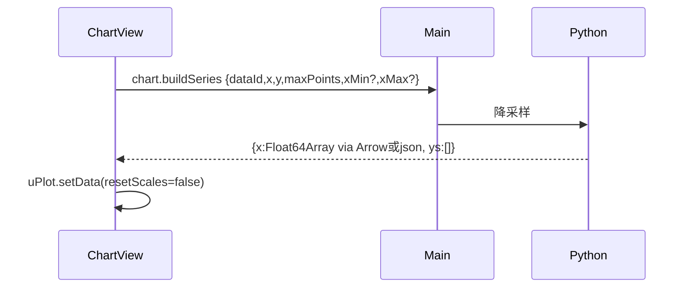

# 图表模块

对标上游 `DAFigure` + `ChartSetting` 的**产品意图**（科研出图、可改样式、矢量导出），不复刻 Qwt 实现。一期把「交互式微调」定义为**属性面板**，不是画布拖标注。

## 一期范围（P4）

**特性**

- ✅ 类型：折线、散点、柱状、直方图
- ✅ 绑定：当前 dataset 的 x 列 + 1..N 条 y 列
- ✅ 样式：标题、轴标签、线色、线宽、网格开关、图例开关
- ✅ 交互：缩放、平移（uPlot 内置）、复位
- ✅ 导出：PNG、SVG、PDF（矢量 SVG → Chromium `printToPDF`，中文标题走系统 CJK 字体）
- ✅ 大数据：`chart.buildSeries` 在 Python 做 min-max 桶或 LTTB，默认上限 5000 点回传；缩放/平移停止 150ms 后按视口带 `xMin`/`xMax` 再取样

## 一期不做

- 子图网格（matplotlib 式 Figure 多 axes）—— 可用多个主区 tab 代替
- 文本/箭头/区域标注拖拽
- 数据探针十字线（可做简易悬停 tooltip，非探针体系）
- 3D、热力、箱线、谱图
- 与 Qwt 工程 `charts.xml` 互导
- Agent 自动绑图

## 数据流



视口变化停止 150ms 后再请求。窗口请求仍 `maxPoints=5000`。小数据未降采样则不重复请求。复位视图省略 `xMin`/`xMax` 拉回全列（不要只对当前窗口 `setData(..., true)`）。数据更新走 `setData`，不要每次销毁 uPlot（会丢掉缩放）。

## 前端结构

`packages/chart-core`：

- `downsample.ts` 仅作测试对照；**生产降采样以 Python 为准**（避免双端不一致）
- `viewport.ts`：scale↔协议 x（时间轴秒→毫秒）、是否该按视口重请求、150ms debounce
- `UPlotChart.ts` 封装 setData/setSize；`hooks.setScale` 在 x 轴变化时回调（忽略自身 setData/render 触发的 scale）
- `exportSvg.ts`：由当前采样点生成矢量（标题/轴/图例/网格）；不要把 canvas 栅格化成 SVG
- `exportPng.ts`：从 uPlot canvas 抓 PNG（含当前缩放）

保存走 Electron 主进程 `chart.saveExport`（另存对话框 + 写字节）。不要把图片经 Python sidecar。PDF 的 `content` 仍是 SVG markup，主进程 hidden `BrowserWindow` + `printToPDF` 转成 PDF 再写盘（保证中文标题；不要用 Helvetica-only 的 svg→pdf 库）。

`apps/src/views/chart`：工具条 + 画布 + 绑定对话框（选列）。

## Python `chart.buildSeries`

- 非数值列：error 1002，提示先 query 或选数值列（对齐上游 Agent 工具的错误策略，但无 Agent）
- NaN：**丢掉非有限 x 的行**；y 的 NaN 序列化为 JSON `null`，uPlot 断线。不要改成插值填缝。
- datetime x：转 epoch ms，uPlot 用 time 轴
- **直方**（`kind:"hist"`）：对 `y` 列在 sidecar `numpy.histogram`，回传箱中心与计数。默认 50 箱。专业 bin 参数见二期。

## 样式对象（存入工程 `charts.json`）

```json
{
  "id": "uuid",
  "type": "line",
  "dataId": "uuid",
  "x": "t",
  "y": ["ch1", "ch2"],
  "title": "Run 01",
  "xLabel": "Time",
  "yLabel": "Value",
  "series": [{"key": "ch1", "color": "#5280C1", "width": 1.5}]
}
```

不存采样点。打开工程后按绑定重新 `buildSeries`。

## 二期（单独排期，不阻塞 MVP）

1. 箱线 / 直方更专业的 bin 参数  
2. 多 subplot  
3. 标注层（SVG overlay）  
4. ~~导出 PDF~~ **已落地**：Ribbon `chart.exportPdf`；渲染进程仍发 SVG markup，主进程 `printToPDF`  
5. 颜色循环与色盲安全色板（可抄上游 icon 色）  

## 验收对照

| 检查 | 通过 |
|------|------|
| 小数据（<2 万点） | 无降采样提示，缩放后点位置与表一致（抽查） |
| 100 万点 | 构建序列 < 3s；交互不掉到 5fps 以下 |
| SVG | 在浏览器或 Inkscape 打开可见曲线与标题 |
| PDF | 另存为 `.pdf` 后可用阅读器打开；中文标题可见 |
