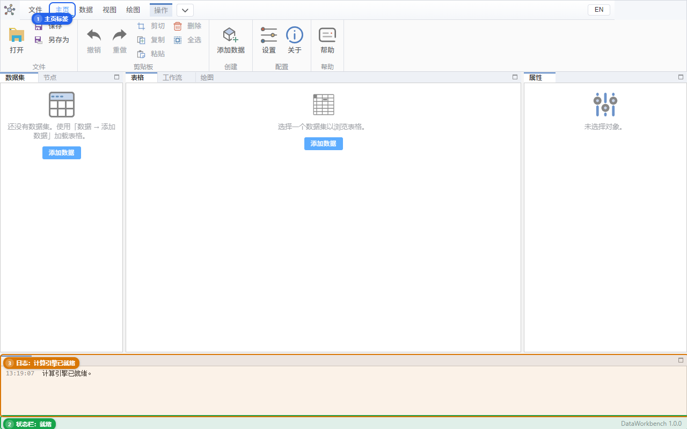

# 01 安装与启动

目标：让窗口出现，底部状态栏显示 **就绪**。做不到后面都没法测。

## 电脑需要什么

| 必须有 | 说明 |
|--------|------|
| Windows 10/11（64 位） | 当前主要支持平台 |
| 本手册示例表 | 仓库里的 `docs/wiki/samples/wiki-demo.csv`（安装包用户请向发放人要这份表） |

**一般用户不需要安装 Python、Node.js 或 pnpm。** 安装包已内嵌 Python 计算环境。

开发者若要从源码启动，才需要 Python 3.11/3.12 和 Node.js，见下方「方式 C」。

## 方式 A：安装向导（推荐给最终用户）

适合：别人发给你 `DataWorkbench-Setup-1.0.0.exe`（版本号以文件名为准）。

1. 双击安装程序。
2. 双击后会弹出 Windows 帐户控制（需要管理员才能写入 `C:\Program Files`）。按向导「下一步」：同意许可。默认目录是 `C:\Program Files\DataWorkbench`（可改）。若改到自己的用户目录，仍可安装。
3. 安装结束可勾选立即运行，或从桌面 / 开始菜单打开 **DataWorkbench**。
4. 看窗口**底部状态栏**：左边圆点变绿并写 **就绪**，才算成功。日志会写「计算引擎已就绪」。
5. 以后可以双击 `.dwproj` 工程文件直接打开（同一时间只开一个窗口）。

不需要再装 Python，也不用在命令行执行 `pip`。

开发者在本仓库打安装包：

```powershell
pnpm pack:win
```

产物：`apps/dist/DataWorkbench-Setup-<version>.exe`（发给用户这一份即可）。同一次构建还会生成便携目录 `apps/dist/win-unpacked/`。首次打包会下载嵌入式 Python 并安装 pandas 等库，体积较大、耗时几分钟。

## 方式 B：便携目录（不解压安装）

适合：别人给了打好的 `win-unpacked` 文件夹，或不想写注册表。

1. 解压后双击 `DataWorkbench.exe`。
2. 同样看底部状态栏是否 **就绪**。便携目录不会注册「双击 `.dwproj`」，请用 **文件 → 打开**。

便携目录同样内嵌 Python。一般不必设环境变量。若要用本机另一套解释器：

```powershell
$env:DW_PYTHON = "C:\Path\To\python.exe"
.\DataWorkbench.exe
```

开发者生成便携目录：`pnpm pack:portable`（或 `.\scripts\pack-portable.ps1`）。

## 方式 C：开发模式（仓库里试）

适合：你已经克隆了 GitHub 仓库，并要改代码。

1. 打开 PowerShell，进入仓库根目录（有 `package.json` 的那一层，例如 `F:\Rep\DataWorkbench`）。
2. 安装界面依赖：

```powershell
pnpm install
```

3. 安装 Python 计算依赖（推荐用仓库自带虚拟环境；若没有，用系统 Python）：

```powershell
py -3.12 -m pip install -r python/requirements.txt
```

4. 启动：

```powershell
pnpm dev
```

5. **不要**用浏览器打开 `http://localhost:5173`。必须等 Electron 窗口自己弹出。
6. 看窗口**底部状态栏**：显示 **就绪**，日志写「计算引擎已就绪」。



关掉窗口即可退出。再开仍执行 `pnpm dev`。

`spawn electron.exe ENOENT` 等开发环境问题见根目录 [README.md](../../README.md)，一般用户改走方式 A。

## 启动自检（30 秒）

- [ ] 窗口可见（标题栏有软件图标，顶部有「文件 / 主页 / 数据 / 视图 / 绘图 …」）。
- [ ] 底部状态栏为 **就绪**，没有一直停在「正在启动」。
- [ ] 不要在 Chrome 里打开 Vite 地址（否则会提示无法连接桌面程序）。

失败先看 [10 常见问题](./10-faq.md)。通过后去做 [08 15 分钟跟做](./08-tutorial.md)。
