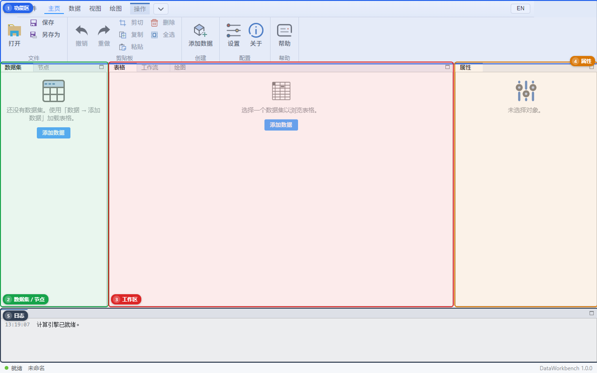

# 02 认识窗口

默认仍是五个分区（编号与图中一致）。**面板标题可以拖到别的分区**，像专业 CAD 的停靠窗口；不能把面板关干净，也不能弹出独立小窗。拖乱了用 **主页 → 复位布局**。

## 1 顶部：功能区（Ribbon）

一排**标签**，点标签下面才出现按钮。

| 标签 | 你在这里做什么 |
|------|----------------|
| **文件** | 新建 / 打开 / 保存 / 另存为 / 退出工程 |
| **主页** | 撤销、重做（只针对**工作流画布**的增删连线，不是改表格格子）；**复位布局**；有的版本还有 Ping |
| **数据** | **添加数据**、移除、重命名、导出。清洗按钮不在这里 |
| **操作** | 清洗、过滤、统计（对**当前选中的那张表**立刻改，或生成新表） |
| **工作流** | 运行 / 停止积木图 |
| **图表** | 新建折线/散点/柱状/直方/子图，标注，导出 PNG/SVG/PDF |

右上角 **中文 / EN** 切换界面语言。最小化、最大化、关闭用窗口最右侧系统按钮。

标题栏最左侧是软件图标。中间空白处可拖动窗口。

## 2 左侧

两个页：**数据集** 和 **节点**。

- **数据集**：已经加载进内存的表。点一行，中间「表格」就显示它。空的时候会提示用「数据 → 添加数据」。
- **节点**：工作流积木清单。拖到中间「工作流」页。

## 3 中间工作区

三个页签：

| 页签 | 作用 |
|------|------|
| **表格** | 浏览当前数据集，可改单元格 |
| **工作流** | 拖节点、连线 |
| **绘图** | 看图、缩放、改样式 |

一次可以只看一个页签，也可以把「表格 / 工作流 / 绘图」拖成左右分栏。导入数据后先看「表格」；画图后会自动切到「绘图」。

## 4 右侧：属性

取决于你点了什么：

- 点了数据集：名称、行列数、每列类型。
- 点了工作流节点：该节点的参数（例如查询表达式）。
- 点了图：标题、轴标签、颜色、线宽、网格、图例。
- 什么都没选：提示「未选择对象」。

## 5 底部：日志

英文/中文夹杂的运行记录。成功导入、筛选删了几行、sidecar 崩溃，都会写在这里。测试时**出问题先看最后几行**。

## 三个容易混的词

| 词 | 白话 |
|----|------|
| 数据集 | 已经进软件内存的一张表，左边列表里的一项 |
| 工程 | 整个工作现场（多张表 + 工作流 + 图），存成 `.dwproj` |
| sidecar | 后台 Python 进程，真正算 pandas 的地方。界面只负责显示 |

下一步：[03 数据](./03-data.md)。
