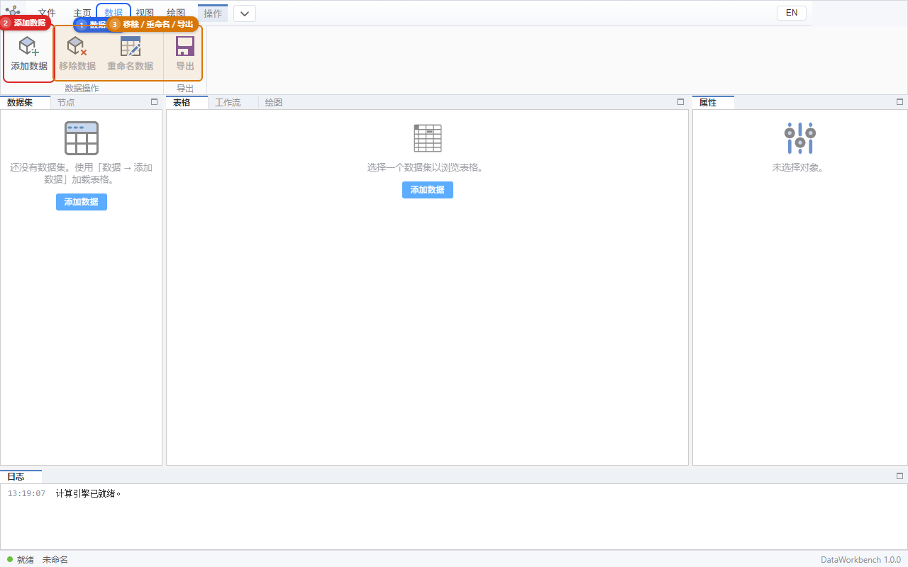
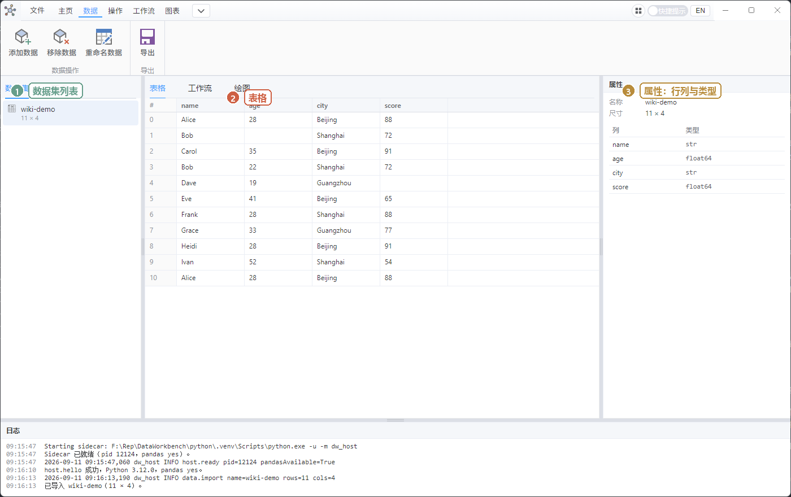

# 03 数据：导入与表格

目标：把 CSV/Excel 放进软件，能滚动、能改一个格子、能导出。

## 添加数据

1. 顶部点 **数据**。
2. 点 **添加数据**（大按钮）。

3. 在文件对话框里选：
   - `.csv`（逗号分隔文本，Excel 另存为 CSV 即可）
   - `.xlsx`（Excel）
   - `.parquet`（列式存储，普通用户较少碰到）
4. 左侧 **数据集** 出现一条名字（通常是文件名）。
5. 中间切到 **表格**，应看到列名和前几行。
6. 底部日志类似：`已导入 xxx（行 × 列）`。行数应和右侧属性、表格里能数到的数据行一致。

跟做请用 `文档\DataWorkbench\wiki-demo.csv`（第一次启动软件后自动复制）。导入成功后大致是这样：

**不能导入**：`.pkl` / pickle（已关闭，防止执行危险文件）。`.dapro` 也不是数据文件。

数据在**内存**里。关掉软件或计算引擎崩溃后，未保存工程就会丢，源 CSV 文件不会被删。

## 选中哪张表

左边点数据集名字。右侧属性显示行数、列数、每列类型（整数、小数、文字等）。  
后面所有「操作」按钮都作用在**当前选中的这一张**上。

## 滚动浏览

表格不会把整张表一次性塞进界面，所以 几十万行也可以滚。你只要：

- 用鼠标滚轮或滚动条往下拉。
- 行列对得上、不卡死即可。不必数是不是正好 512 行一块。

空表时中间会提示「选择一个数据集以浏览表格」。

## 改一个格子

1. 双击单元格，进入编辑。
2. 改完按 **Enter** 确认，或点别处让它失焦。
3. **Esc** 取消这一格。
4. 改完若要留到文件：用 **数据 → 导出**，或 **文件 → 保存** 工程。

类型不对（例如数字列写成 `abc`）会提示值不匹配，格子可能还原。

## 重命名 / 移除 / 导出

都在 **数据** 标签：

| 按钮 | 作用 |
|------|------|
| **重命名数据** | 只改软件里的显示名，不改磁盘上的原文件 |
| **移除数据** | 只从内存拿掉，会确认。原 CSV/Excel 还在 |
| **导出** | 把当前表另存为 csv / xlsx / parquet 等（对话框选路径） |

导出 CSV 一般是带 BOM 的 UTF-8，用 Excel 打开中文不易乱码。用记事本打开时，**第一行应是列名**（例如 `name,age,city,score`），下面才是数据行。

## 自测

- [ ] 导入 `wiki-demo.csv`，左边出现数据集，表格能看到 `name,age,city,score`。
- [ ] 往下滚到底再滚回来，窗口不卡死、不崩。
- [ ] 改 `Alice` 的 `score` 再改回去。
- [ ] 重命名后再改回原名。
- [ ] 导出一份 csv，用记事本打开能看到第一行列名，用 Excel 也能打开。
- [ ] 点移除，确认后列表空了；磁盘上的 `wiki-demo.csv` 还在。

下一步：要么 [04 操作](./04-operate.md) 洗这张表，要么 [08 跟做](./08-tutorial.md)。
