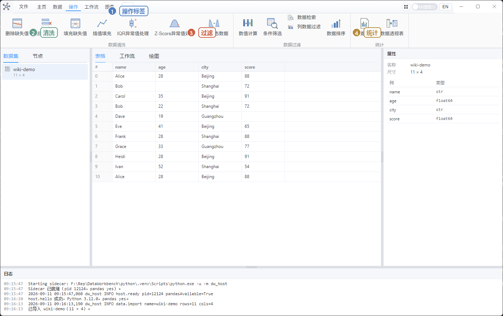
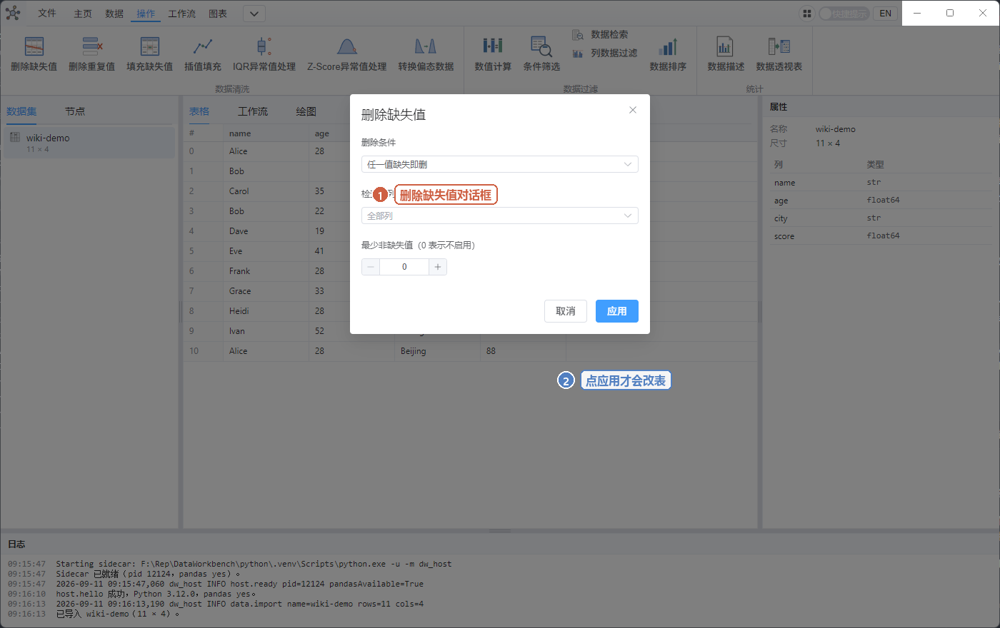
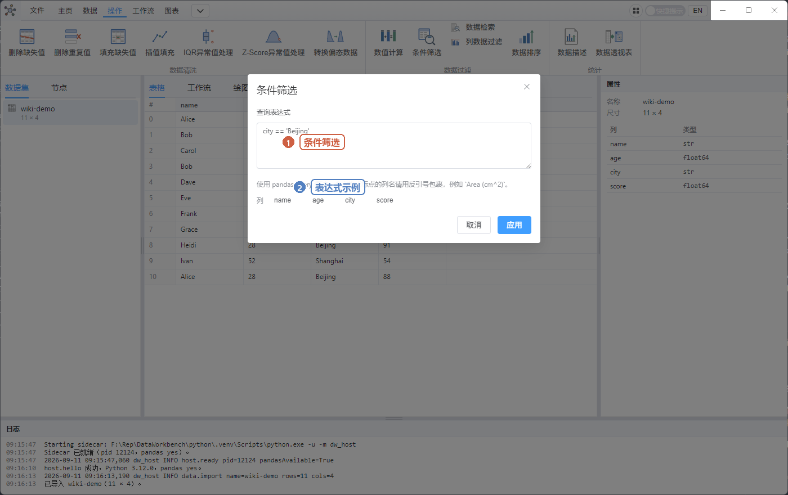

# 04 操作：清洗与统计

先点中间 **表格**，顶部才会出现 **操作** 标签。这些按钮都对**左边当前选中的数据集**立刻生效（统计类会**另外生成一张新表**，原表不动）。

先选中表，再点按钮。对话框里点 **应用** / **生成** 才执行，**取消** 则什么都不改。

下面用白话说明。示例表是 `docs/wiki/samples/wiki-demo.csv`。

## 数据清洗

| 按钮 | 什么时候用 | 你会看到什么 |
|------|------------|--------------|
| **删除缺失值** | 格子空着（缺失） | 默认「任一值缺失即删」：`Bob` 那行 age 空、`Dave` 那行 score 空，这两行会被删掉 |
| **删除重复值** | 两行完全一样 | 可选保留第一次 / 最后一次 / 全删。列不选则整行比。示例表末尾有两行相同的 Alice |
| **填充缺失值** | 不想删行，想填上 | 固定值、向前/向后填、用该列平均值/中位数/众数 |
| **插值填充** | 数值列中间有空，想按趋势补 | 常用「线性插值」。空太多或非数值列可能补不上 |
| **IQR异常值处理** | 个别数字离群特别远 | 按「箱子」内外篱笆找极端值，可删行或替换 |
| **Z-Score异常值处理** | 同上，按「离平均值几个标准差」 | 小样本（例如 10 行）结果不一定好看，测功能即可 |
| **转换偏态数据** | 一列特别歪（很多小值、少数极大值） | 对数、平方根等。有 0 或负数时部分方法会失败，属正常 |

**替换值、阈值筛选** 在顶部功能区**没有按钮**（和专业版 Qt 软件一致）。若要用：到左侧 **节点** 里拖 `Replace Values` / `Threshold Filter`，见 [05 工作流](./05-workflow.md)。

### 建议第一次这样点

1. 导入 `wiki-demo.csv`，看表格：`Bob` 的 age 空，`Dave` 的 score 空。
2. **操作 → 删除缺失值** → 保持默认 → 应用。行数应变少，日志写删除了几行。

3. **文件 → 新建**（可先不保存）再重新导入，改试 **填充缺失值**：方法选「固定值」，填 `0`，应用到 `age` 和 `score`。空格子应变成 0。

## 数据过滤

| 按钮 | 白话 | 跟做例子（列名区分大小写） |
|------|------|----------------------------|
| **条件筛选** | 只留下符合一句话的行 | `age > 30` 或 `city == 'Beijing'` |
| **数据检索** | 某一文字列里「包含」某段字（正则） | 列选 `name`，模式填 `a`（不区分大小写会匹配 Alice 等） |
| **列数据过滤** | 某一**数值**列落在区间内（含两端） | 列 `score`，最小 70，最大 90。开关关掉表示这一侧不限制。**0 是数字零，不是「不限制」** |
| **数据排序** | 按列排 | 选 `age`，升序 |
| **数值计算** | 用列算出新列 | 必须写成赋值：`score2 = score + 1`。只写 `score + 1` 会被拒绝 |

条件筛选用的是 pandas 的 query 语法，对新手够用的只有：

- 比较：`age > 25`、`age >= 18`、`score < 80`
- 相等：`city == 'Beijing'`（文字两边用英文单引号）
- 组合：`age > 25 and city == 'Beijing'`
- 列名有空格或符号时用反引号：`` `Area (cm^2)` > 1 ``

筛完**原表就被改短了**。若还要完整表：先 **文件 → 保存**，或先 **数据 → 导出** 一份备份，或用工作流输出到**新名字**的数据集（见 05）。

## 统计（会生成新表）

| 按钮 | 结果 |
|------|------|
| **数据描述** | 新数据集，默认名类似 `xxx describe`。里面是 count/mean/标准差等，原表不变 |
| **数据透视表** | 新数据集，默认 `xxx_PivotTable`。至少选一列做「行索引」，例如 `city`，值选 `score`，聚合选「均值」 |

左边列表会多出一条。点它才能在表格里看到统计结果。

## 自测

- [ ] 删除缺失值后行数减少，日志有「删除」。
- [ ] 条件筛选 `age > 30` 后只剩年龄大于 30 的行（空 age 的行也不会留下）。
- [ ] 排序后 age 从上到下递增或递减。
- [ ] 数据描述后左边多一张表，原表示意数据还在。
- [ ] 透视表：行索引 `city`，值得分 `score`，均值；新表能打开。
- [ ] 数值计算只输入 `score + 1` 应失败；改成 `s2 = score + 1` 应成功并多一列。

下一步：[05 工作流](./05-workflow.md) 或 [06 图表](./06-chart.md)。
