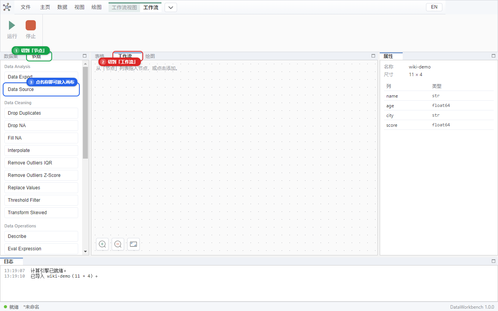
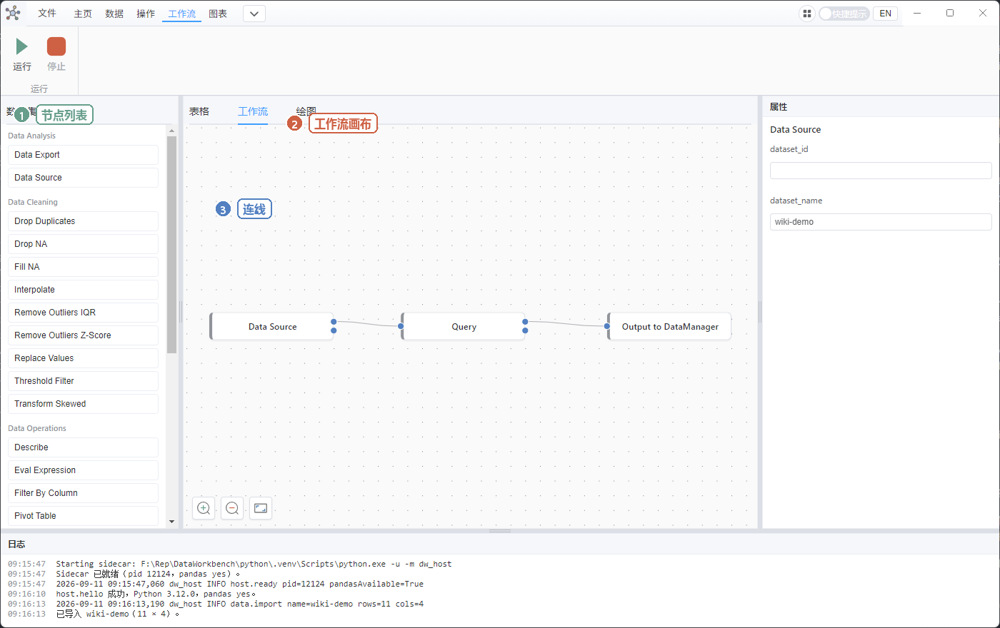

# 05 工作流

工作流 = 把「取表 → 筛选 → 再放回列表」画成积木，以后换数据再点一次 **运行**。

适合：同一套清洗要做很多份实验文件。只做一次的话，用 [04 操作](./04-operate.md) 更快。

## 节点名字是英文

左侧节点列表里的名称（如 `Data Source`、`Query`）**保持英文**，这是保存工程用的稳定名字，不要当成翻译错误。

| 英文名 | 干什么 |
|--------|--------|
| Start / End | 流程起止（可以不用 Start，数据流仍可跑） |
| Constant | 输出一个常数 |
| Delay | 故意等几秒，用来试 **停止** |
| Output to DataManager | 把结果**发布**到左边数据集列表 |
| Text Viewer | 在节点方块上显示一段文字 |
| If / Else | 条件分支；不满足的那边没有数据往下传 |
| Data Source | **从已经导入的数据集取表**（不读磁盘文件） |
| Query / Drop NA / Fill NA / Sort / … | 和「操作」标签同一套算法，但是连在图里 |
| Replace Values / Threshold Filter | 只有节点，功能区没有按钮 |
| Data Export | 把**连进来的表**写成文件（不是「当前选中的那张」） |

## 最短能跑通的一条

先把节点列表和工作流页打开（不要在「数据集」页拖）：

1. **数据 → 添加数据**，导入 `wiki-demo.csv`，记住左边显示的名字（多半是 `wiki-demo`）。
2. 左侧切到 **节点**。
3. 中间切到 **工作流**。
4. 依次拖入（或点名称）：`Data Source`、`Query`、`Output to DataManager`。
5. **连线**：从节点右侧小圆点拖到下一个节点左侧小圆点。
   - Data Source 的数据输出口 → Query 的数据输入口
   - Query 的结果口 → Output to DataManager 的数据口
6. 点 `Data Source`，右侧属性填 **dataset_name** 为刚才的数据集名（或填 dataset_id）。
7. 点 `Query`，在表达式里填：`age > 25`
8. 点 `Output to DataManager`，把 **data_name** 改成 `adults`（不要和原表同名，便于看出新表）。

连好后应类似下图。确认中间是 **工作流** 页（顶部会出现 **工作流** 标签），再点 **工作流 → 运行**。

9. 顶部 **工作流 → 运行**。
10. 节点应变色表示完成；左边应出现 `adults`；日志「工作流已完成」。
11. 点 `adults`，表格里应只有 age 大于 25 的行（age 为空的行不会进入）。

连错了：点连线再删，或 **主页 → 撤销**（Ctrl+Z）。撤销只管画布，不管表格格子。选中节点后 **主页 → 复制 / 粘贴 / 删除 / 全选** 也按画布焦点生效。

## 运行与停止

- **运行**：按拓扑顺序执行。正在跑时不要改图，否则会提示忙碌。
- **停止**：正在 Delay 等待时可以停。普通筛选一瞬间结束，可能来不及点停止。

## 常见失败

| 现象 | 原因 |
|------|------|
| Data Source 没数据 | 没先导入表，或名字拼错（含空格、大小写） |
| Query 失败 | 表达式语法错；列名写错；文字没加引号 |
| 左边没有新表 | 忘记连到 Output to DataManager，或没点运行 |
| 打开旧工程节点变空 | 见 [07 工程文件](./07-project.md)，必须先有逻辑再显示位置 |

## 自测

- [ ] 上面「最短一条」能跑通，`adults` 行数少于原表。
- [ ] Ctrl+Z 能撤掉误删的连线（先故意删一根再撤销）。
- [ ] 拖一个 Delay（例如 3 秒），运行后立刻点 **停止**，日志出现已停止。
- [ ] 把 Query 改成非法表达式再运行，节点失败，日志有原因，软件不闪退。

下一步：[06 图表](./06-chart.md) 或 [08 跟做](./08-tutorial.md)。
