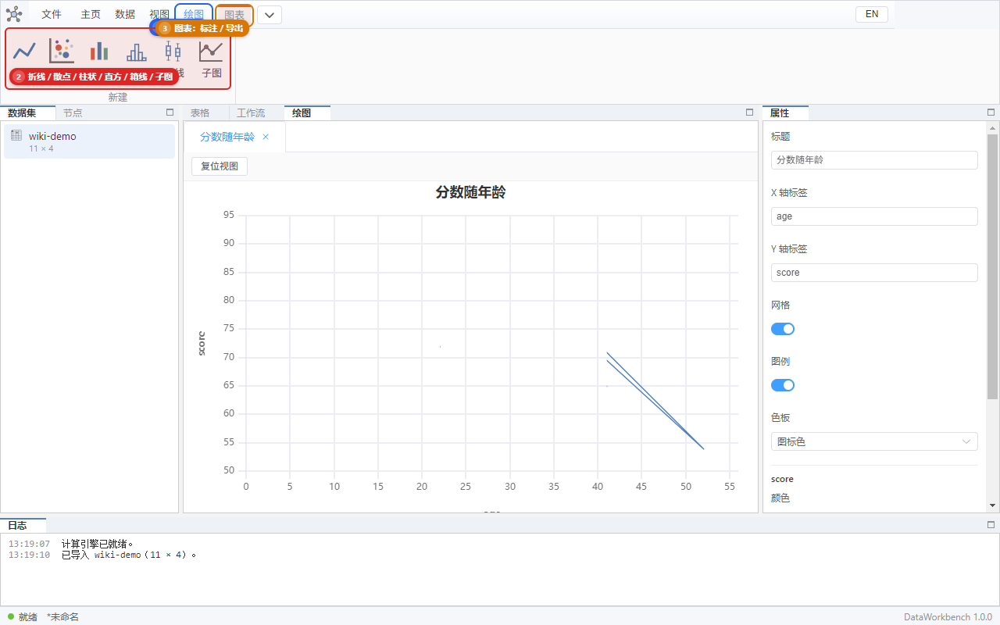
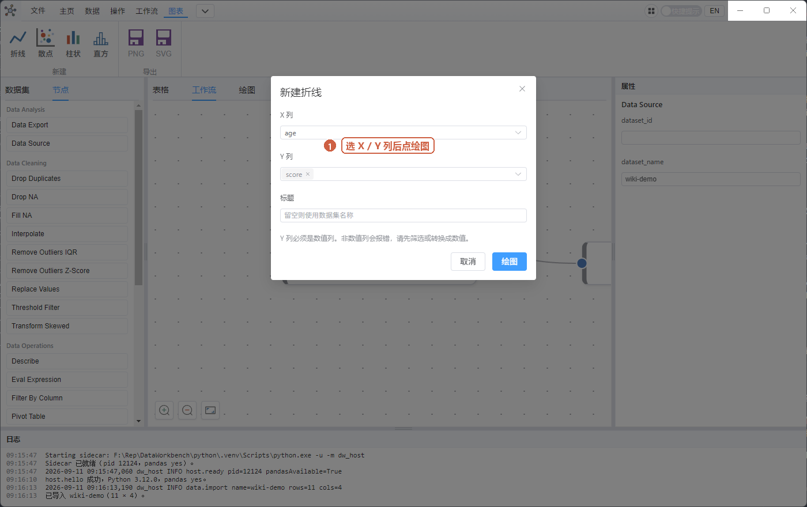
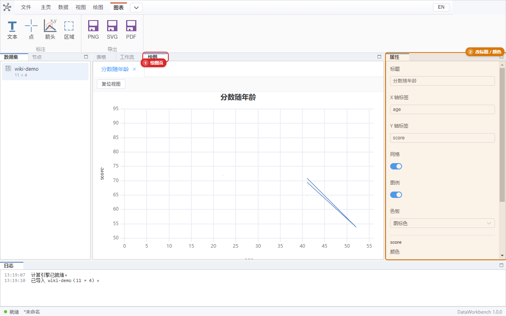

# 06 图表

目标：对当前表画一张图，改标题和颜色，导出 PNG、SVG 或 PDF。

**新建**在常驻的 **绘图** 标签。**标注和导出**要先点中间「绘图」工作区，功能区右侧才会出现 **图表** 标签。不要到「数据」「操作」里找。

## 画一张折线

1. 左边选中有**数值列**的表（`wiki-demo.csv` 的 `age`、`score` 是数值；`name`、`city` 是文字）。
2. 顶部 **绘图 → 折线**。
3. 对话框：
   - **X 列**：例如 `age`
   - **Y 列**：例如 `score`（可多选）
   - 标题可留空（会用数据集名）

4. 点 **绘图**。
5. 中间切到 **绘图**，应出现曲线。
6. 日志类似「已绘制 … 点」。

散点、柱状步骤相同，只是按钮换成 **散点** / **柱状**。

**直方**：对一列数值数「落在各区间的个数」。选一个数值列即可，不需要 X/Y 成对。默认 50 个箱子，由 Python 计算。绑定对话框可改箱数；画好后右侧属性可改箱宽、统计量（频数/密度/概率/百分比）和是否累计。箱宽大于 0 时优先于箱数。

**箱线**：看一列（或多列）数值的分布：箱子是四分位，须是 1.5×IQR（和常见统计软件默认一样），点是离群值。选数值列即可，不要 X。计算在 Python 完成；每列最多画出 200 个离群点。

## 子图

一张绘图页里并排/上下放多张小图（论文常用）。

1. **绘图 → 子图**，选网格（如 1×2、2×2），最多 3×3。
2. 中间出现空格子。点一个格子（蓝框）。
3. 再 **绘图 → 折线**（或散点/柱状/直方/箱线）绑数据，图画进这个格子。
4. 点另一个空格，重复绑。

导出 PNG/SVG/PDF 会带上整张图组。格子不能拖着改大小；要换布局就新建一页子图。

原来的「折线」仍是单独一页一张图。只有点了「子图」之后，新建曲线才会填进格子。

## 改样子

点图或保持绘图页打开，右侧 **属性**：

- 标题、X 轴标签、Y 轴标签
- **色板**（图标色 / 色盲安全），以及每条曲线的颜色、线宽
- 网格、图例开关
- 直方还可改箱数、箱宽、统计量、累计

改完**请看图本身**，不应只看右侧输入框里的字。不需要重新点「折线」，除非要换列。

## 缩放

在图上拖动缩放/平移（鼠标操作与常见科学绘图类似）。点 **复位视图** 回到全貌。

数据很多时，界面只会画大约几千个点（软件在 Python 里抽样）。缩放停约 0.15 秒后会按当前窗口再取一次样，所以放大后形状仍大致跟表一致。状态里可能写「显示 5000 / 1000000 点」之类。

## 标注

画好图后可用 **图表 → 文本 / 点 / 箭头 / 区域**，再到图上点击放置（箭头和区域要点两次）。Esc 取消。

- 文本、点：点一下。
- 箭头：先点起点，再点终点。
- 区域：点两个 X 位置，画出竖向色带（适合标一段区间）。

放好后在右侧 **属性** 改文字、颜色，或删除。标注会随缩放移动，并会写进工程文件；导出 PNG / SVG / PDF 时也会带上。

这不是在图上任意拖框的绘图板，只放标记。

## 导出

**图表 → PNG**、**SVG** 或 **PDF**，选保存路径。

- PNG：位图，适合贴聊天、预览。
- SVG：矢量，放大不糊，适合 Word / 论文（用 Word「插入 → 图片」）。
- PDF：矢量页，适合直接交稿或打印；中文标题会保留。

没有图时导出会提示先绘图。

## 失败常见原因

| 提示 | 怎么办 |
|------|--------|
| 列不是数值列 | Y、直方或箱线不要选 `name`。先用操作把列转成数字，或换列 |
| 没有足够的数值点 | 空值太多。先填充或删除缺失值 |
| 图是空白 | 确认已经切到中间「绘图」页；试复位视图 |

## 自测

- [ ] 折线：X=`age`，Y=`score`，图上有点/线。
- [ ] 改标题为「试画」，图上标题变化。
- [ ] 改线色，能看出来。
- [ ] 散点、柱状、直方、箱线各成功一次。
- [ ] 导出 PNG、SVG、PDF 各一份，能用图片查看器、浏览器或 PDF 阅读器打开。
- [ ] 放一个文本标注，导出的 SVG 里能搜到该文字。
- [ ] **绘图 → 子图** 选 1×2，两个格子各绑一条折线。
- [ ] 用文字列当 Y，应报错而不是画错图。

下一步：[07 工程文件](./07-project.md)。
