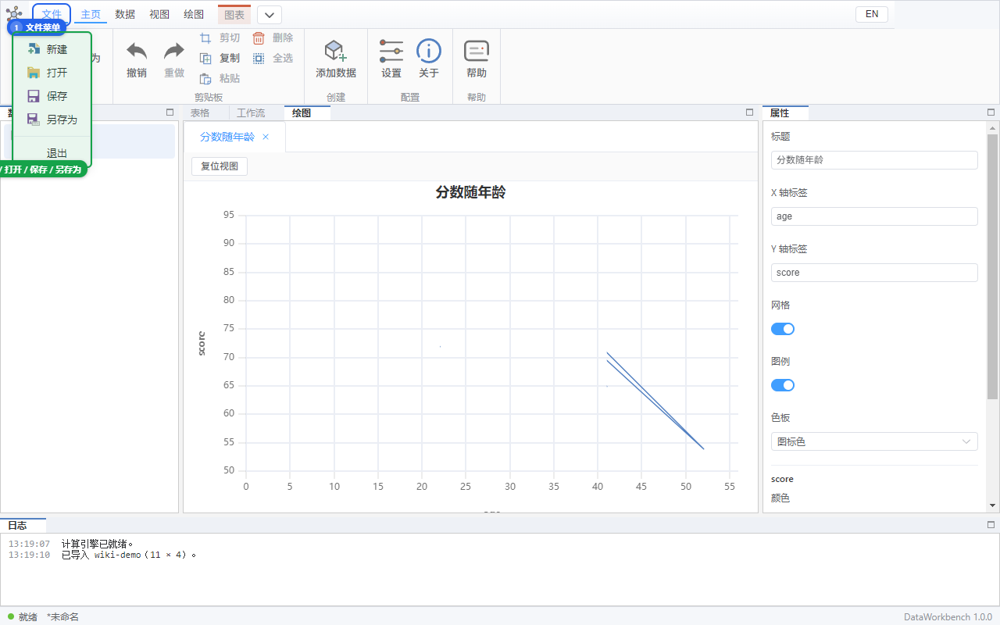

# 07 工程文件

工程文件扩展名是 **`.dwproj`**（本质是 ZIP）。它记住：

- 工作流怎么连、参数填了什么
- 当时打开的页签、分隔比例，以及你拖过的面板停靠（下次打开还在）
- 图表的列绑定和样式（**不存**曲线上每一个点，打开后会按表重算）
- 当时内存里的表（存成 parquet）

**不是** `.dapro`，也不能用 Excel 直接打开。

## 新建 / 打开 / 保存

点左上角 **文件**（下拉带图标）：

| 命令 | 快捷键 | 作用 |
|------|--------|------|
| 新建 | Ctrl+N | 空工程。若当前有未保存修改，会问是否保存 |
| 打开 | Ctrl+O | 选一个 `.dwproj` |
| 保存 | Ctrl+S | 已有路径则覆盖；第一次等于另存为 |
| 另存为 | Ctrl+Shift+S | 换路径 |
| 退出 | | 关软件，同样会问未保存 |

对话框标题里的「未保存的更改」：可选 **保存** / **不保存**。

保存成功日志：「工程已保存」。打开成功：「工程已打开」。窗口标题会带工程名；有未保存改动时通常带 `*`。

## 建议的保存习惯

1. 导入数据、改了表或图画完，就 Ctrl+S。
2. 计算引擎崩溃后内存表会丢，**只能靠已保存的工程恢复**。
3. 写盘过程若被强制杀进程，应仍能打开**原来**的 `.dwproj`（软件先写临时文件再替换）。

## 自测

- [ ] 导入表示例 → 保存 `test.dwproj` → 退出软件 → 再打开，表还在，行列对。
- [ ] 做一条工作流再保存，重开后节点还在、连线还在、点运行仍能出结果。
- [ ] 画过折线的工程重开后，绘图页能重新出现曲线（允许重算，不要求像素级一样）。
- [ ] 把日志面板拖到别处后保存、重开，停靠还在；**视图 → 复位布局** 能回到默认左/中/右/底。
- [ ] 另存为一份新路径，两份文件都能开。
- [ ] 打开一个随便改后缀的 txt，应提示不是 DataWorkbench 工程，当前内容不被半覆盖。

下一步：用 [08 跟做](./08-tutorial.md) 把 03–07 串起来，或直接用 [09 测试清单](./09-test.md) 打钩。
